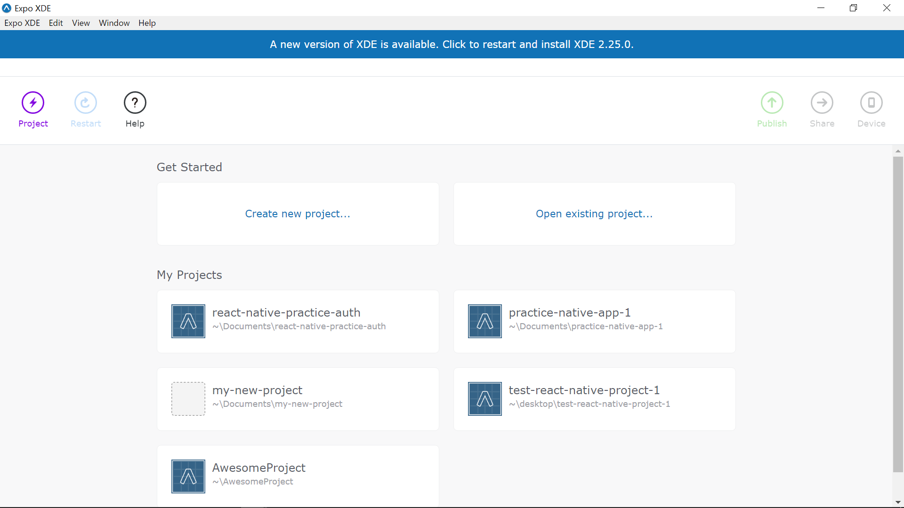
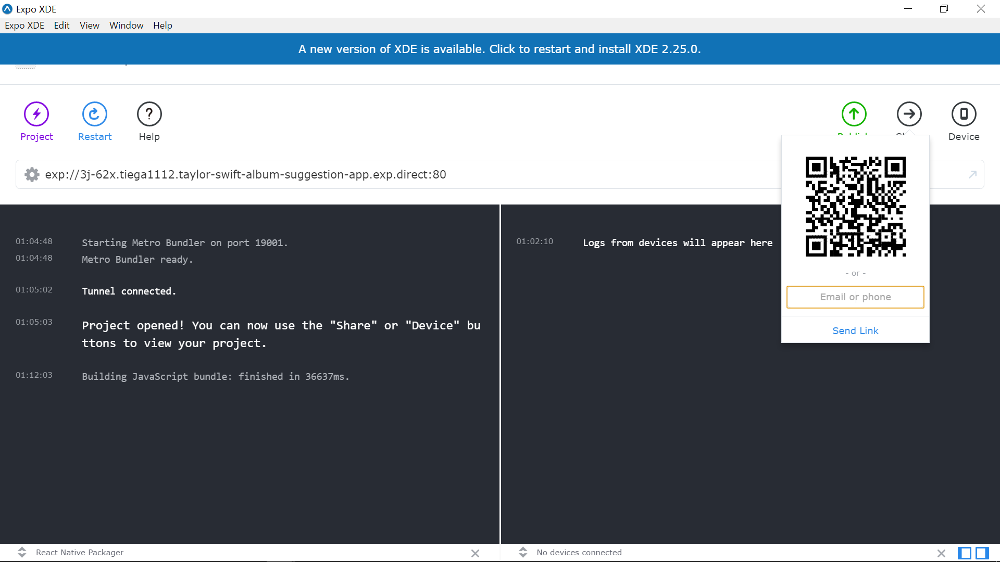
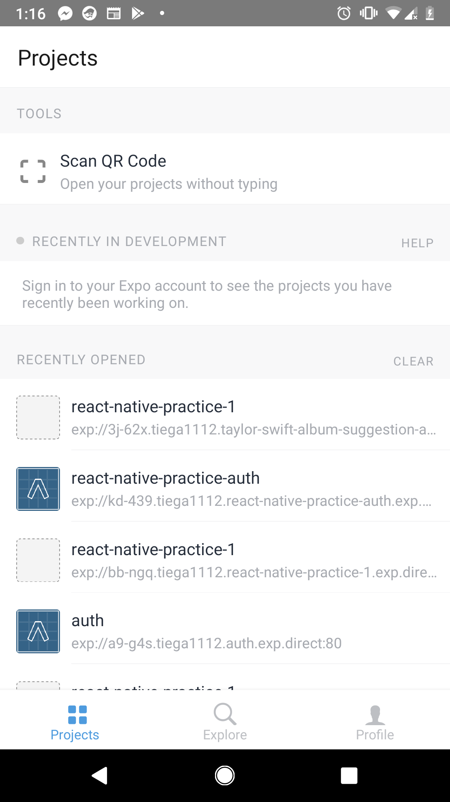
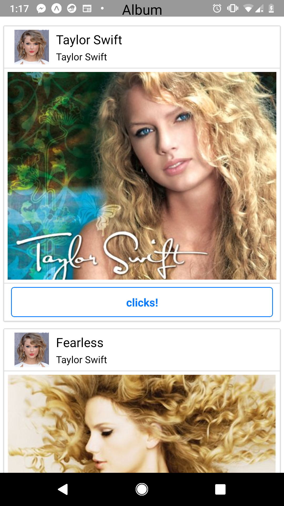

# Taylor-Swift-album-suggestion-app

Practice Mobile application project created with React native.

# Requrement

You might need to install [Expo XDE](https://expo.io/) on desktop and your phone (ios/android)

# Setup

## Install

```
git clone https://github.com/TaigaMatsumoto/Taylor-Swift-album-suggestion-app-.git
cd Taylor-Swift-album-suggestion-app
npm install
```

## Run

Open Expo XDE on desktop, and open this root repository from "Open existing project..."\n

Expo will provide QR code, then you scan QR code with your Expo app on your phone\n

Open camera from "scan QR code" on your Expo app\n

Wait to load files to run code\n

Now you are able to use my mobile app:)\n


# Usage

This app is made for practice purpose. You can try my taylor swift app:)

# References

https://www.udemy.com/the-complete-react-native-and-redux-course/
